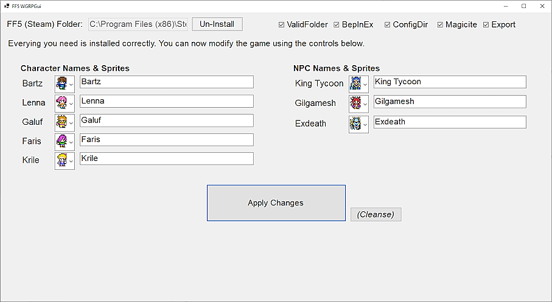

# What is This?
FF5 "Re Sprite" is a small tool that allows you to change the names and sprites for player characters and some NPCs in Final Fantasy V (Pixel Remaster) for Steam. 

It was developed as part of the Tournament held by White Giant RPG Studios, LLC (WGRPG), to allow us to personalize our parties while racing through FF5. In short, it turns the main game into this:

# License Notes
This project is licensed under the MIT License, but certain modules in the "in" folder have their own license files. Anything in the "sprites" folder is using a non-commercial license,
so please remove the "sprites" if you use this to make a commercial product. Please read all LICENSE files for the exact details.

# Installation
First, install the .NET runtime: https://dotnet.microsoft.com/en-us/download

Next, download the latest Release <TODO_LINK> and unzip all of the files into some folder.

Now, click on "FF5_MultiTool.exe", and you will be greeted with a screen similar to the following:

The "ACTION NEEDED" line will help guide you through the installation of the mod. If you have BepInEx and Magicite installed already, you may not see any "ACTION NEEDED" entries at all.
If so (or if you prefer to install these manually), then proceed to the next section. Otherwise, do the following:
1. Read the "ACTION NEEDED" text.
2. Click the Button to either "Install" some dependency or "Start FF5".
3. If you clicked "Start FF5", wait until you reach the title screen, then close FF5 (unless the game closes itself before that).
4. The "ACTION NEEDED" text should update; go back to 1.

Make sure you are patient --some of these steps can take a while! Eventually, you will see no more "ACTION NEEDED" text, and you can go on to the next section.

# Using the Mod
You'll know you're ready to start using the mod when you see the following:

You can change each character's name by typing into each Text Box, and you can change their sprite by clicking the ">>" next to their image and choosing a new one.
In addition to mixing up the in-game graphics, you'll also see custom graphics for some of the members of WGRPG. 
Make whatever changes you want, then click "Apply Changes". You'll see some green confirmation text --at this point, you can load up FF5 and you'll see your
custom names and graphics!

If you want to revert the changes, you can click "(Cleanse)", and the custom names + art will be removed (but the mod will remain installed).
If you want to remove the mod entirely, you can click the "Un-Install" button at the top of the screen.
In rare cases, you may need to perform a Manual Uninstall; this is covered in a later section.

**Note on Name Changes**: Our code can only change a character's name **before** they join the party. So, you will need to use a save file from before
Bartz enters the Tycoon Meteor area if you want to change the names of Bartz, Lenna, or Galuf (and presumably similar restrictions apply for Faris and Krile.
Graphics changes (and NPC name changes) should take effect at any time. (If you wanted to change your party members names after they join, you'd have to edit your
save files --this is possible, but it's outside the scope of this project.)

TODO: confirm NPC names do change whenever.

# Custom Graphics
This mod allows you to add your own custom sprites to the drop-down menus! Here's how to do that:
* Make a copy of the "Custom_Template.png" file here: https://github.com/sorlok/FF5ReSprite/blob/main/Custom_Template.png
** ...call it "Custom_Bob.png" if you are making a sprite for "Bob", and put it into the "sprites" folder.
* Edit your "Custom_Bob.png" file, and put a 16x16 sprite in each of the designated areas. I've put the in-game name of the "action" for each sprite, so "HandsUp_00", for example, is the first frame in the raised-hand animation.
** If you're not sure what each "action" means, look at the existing sprites for inspiration (Andrew Sprite sheet.png, Josh Sprite sheet.png, etc.)
* Now restart the "FF5_MultiTool.exe" program --you should now see your custom sprite "Bob" in the drop-down list for each character or NPC!

# Manual UnInstall

TODO: explain

# Steam Directory Not Found?

TODO: Custom steam dir

# Disclaimer

This project is a "best effort" kind of thing --and I'm not really a frontend developer.
If you run into any problems, please raise an Issue and I'll do my best to look into it, unless
I've lost interest or am busy or FF17 just came out or I just don't feel like it.
I'd highly encourage you to expand this project to suit
your own needs if you're interested in that! (In which case, please follow the terms of the LICENSE.)

# Credits

TODO: code + art credits

# TODO: more sections

steam dir, manual uninstall, custom graphics, disclaimer, credits (art + code) etc.

 

